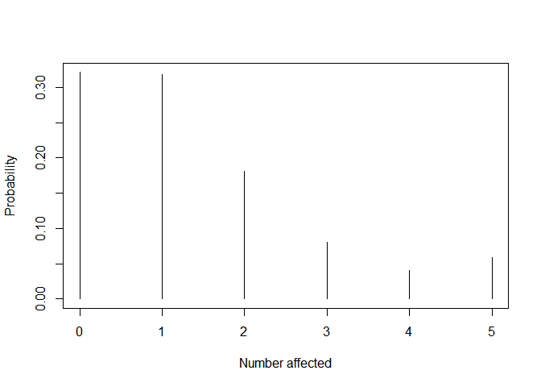

<!-- README.md is generated from README.Rmd. Please edit that file -->

# Regression models for clustered exchangeable binary data

<!-- badges: start -->

<!-- badges: end -->

The goal of the `exchreg` is to fit semi-parametric relative-risk and
generalized linear regression models for exchangeable clustered binary
data with between-cluster covariates. You can browse its [source
code](https://github.com/anikoszabo/exchreg).

## Installation

In the future, this package will be released on CRAN, but currently the
development version is available on [GitHub](https://github.com/) with:

``` r
# install.packages("devtools")
devtools::install_github("anikoszabo/exchreg")
```

## Example: developmental toxicology study

The `boric_acid` dataset contains the outcomes of a developmental
toxicity experiment of boric acid by the National Toxicology Program.
Pregnant mice were provided feed containing boric acid at different
concentrations. At the end of the study, each mouse’s uterus was
examined to evaluate the fetal outcomes. The data contains the size of
each litter, the number of fetuses with an adverse event (resorption,
intra-uterine death, or malformation), as well as the dose group. Since
the same combination of clustersize/response count can occur multiple
times, a frequency count column records the number of such replicates.

``` r
library(exchreg)
library(CorrBin)
head(boric_acid)
#>   Trt ClusterSize NResp Freq
#> 1   0           3     0    1
#> 2 0.1           6     0    1
#> 3 0.1          10     0    1
#> 4   0          11     0    1
#> 5 0.1          11     0    1
#> 6 0.2          11     0    1
```

The goal is to model the effect of the covariates (here, treatment dose)
on the probability of adverse event, while providing predictions for the
entire distribution of the outcomes, ie the probability of observing
\(x\) events in a cluster (litter) of size \(n\).

### Semi-parametric GLM

We can fit a semi-parametric GLM with a logit-link

``` r
mod1 <- spglm(cbind(NResp, ClusterSize - NResp) ~ Trt, data=boric_acid, weights=Freq)
mod1
#> 
#> A semi-parametric generalized linear regression model fit
#> 
#> Call:
#> spglm(formula = cbind(NResp, ClusterSize - NResp) ~ Trt, data = boric_acid, 
#>     weights = Freq)
#> 
#> Coefficients:
#>             Estimate Std. Error z value Pr(>|z|)    
#> (Intercept)  -2.3880     0.2788  -8.565  < 2e-16 ***
#> Trt0.1        0.5273     0.3569   1.478 0.139531    
#> Trt0.2       -0.2133     0.4205  -0.507 0.611944    
#> Trt0.4        1.4202     0.3938   3.606 0.000311 ***
#> ---
#> Signif. codes:  0 '***' 0.001 '**' 0.01 '*' 0.05 '.' 0.1 ' ' 1
#> 
#>  Baseline probabilities (q0):
#>         0          1          2          3          4          5          6  
#> 1.749e-01  3.139e-01  3.898e-02  2.242e-01  1.762e-01  7.468e-07  6.031e-02  
#>         7          8          9         10         11         12         13  
#> 4.625e-07  3.076e-07  2.482e-07  2.476e-07  1.017e-02  1.329e-07  9.319e-08  
#>        14         15         16  
#> 6.041e-08  5.108e-08  1.342e-03  
#> 
#>  Log-likelihood:  -130
```

The prediction method can be used to obtain the predicted probabilities
for any given outcome. For example, we estimate the probability of
having 0 - 5 affected fetuses in a litter of size 5 at dose level 0.4:

``` r
pred <- predict(mod1, newdata = data.frame(Trt = rep("0.4", 6)), newn=5, newevents = 0:5, type="prob")
plot(0:5, pred, type="h", xlab="Number affected", ylab="Probability", ylim=c(0,max(pred)))
```


